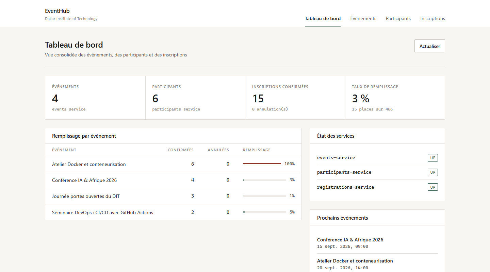
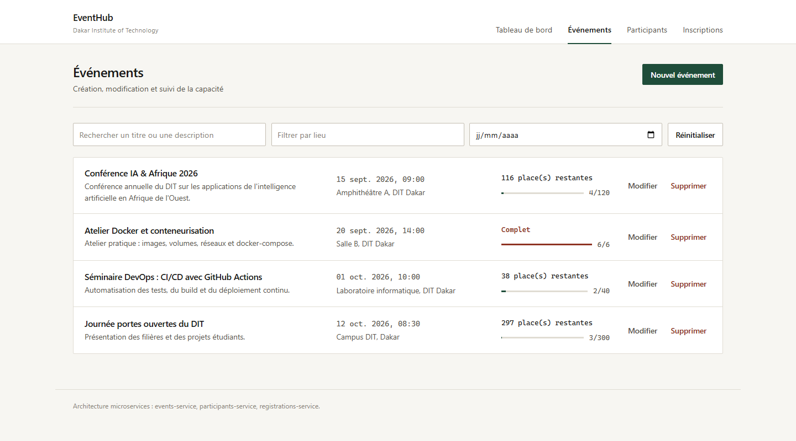
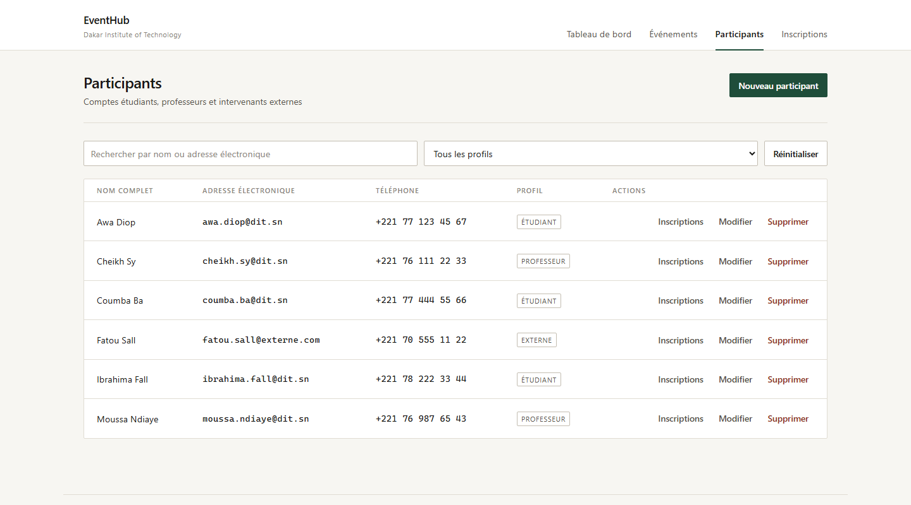
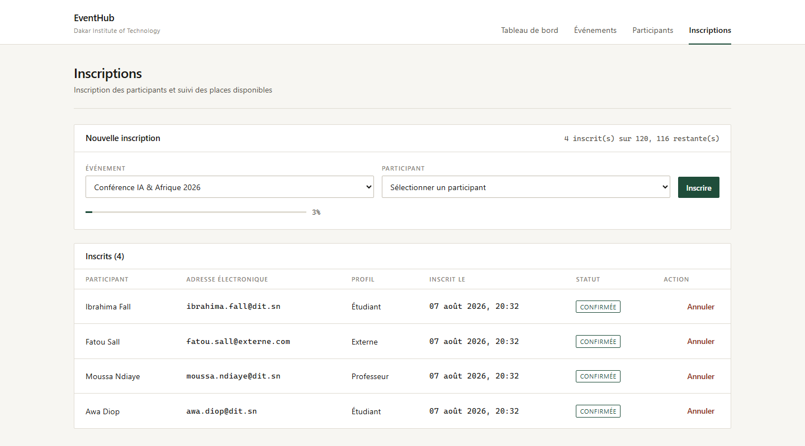

# Rapport de projet : EventHub

**Plateforme de gestion d'événements du Dakar Institute of Technology**

Examen pratique DevOps, Master 1 Intelligence Artificielle
Période : 5 août 2026 → 19 août 2026

Auteur : Makilou Cherif Tine (projet individuel : backend, frontend et DevOps)

---

## 1. Introduction

Le DIT organise régulièrement des conférences, des ateliers et des séminaires.
Pour gérer les inscriptions, on utilise aujourd'hui un mélange de Google Forms,
de fichiers Excel et d'emails. Ça marche à peu près, mais l'information est
éparpillée partout : le nombre de places restantes n'est connu qu'en comptant
à la main, personne n'a de vue d'ensemble, et les coordonnées des participants
sont incomplètes.

EventHub est une plateforme web qui regroupe tout ça au même endroit : créer
et gérer des événements, inscrire des participants, suivre le remplissage en
temps réel, et consulter des statistiques.

Le projet devait aussi me faire travailler une chaîne DevOps complète :
architecture microservices, Docker, CI/CD avec GitHub Actions, et gestion de
projet avec Git (branches, Pull Requests).

**Ce qui a été livré :**

- Événements : création, modification, suppression, liste avec filtres (date,
  lieu, recherche), détail, places restantes
- Participants : création de compte (nom, email, téléphone, type), modification,
  suppression, liste, recherche par email ou nom
- Inscriptions : inscription, annulation, liste par événement ou par participant,
  statistiques, contrôle des places disponibles
- Un tableau de bord qui consolide les trois services, et un jeu de données de
  démonstration (`scripts/seed-demo.mjs`)

## 2. Architecture

### Vue d'ensemble

Trois services backend, un frontend React, et un PostgreSQL découpé en trois
bases (une par service) :

```
┌──────────────────────────────────────────────────────────────────────────────┐
│                              NAVIGATEUR                                       │
└───────────────────────────────────┬──────────────────────────────────────────┘
                                    │ HTTP  :8080
┌───────────────────────────────────▼──────────────────────────────────────────┐
│  CONTENEUR frontend                                                           │
│  ┌─────────────────────────┐        ┌──────────────────────────────────────┐  │
│  │ React 18 + React Router │        │ Nginx 1.27                           │  │
│  │ (fichiers statiques)    │◄───────┤ · sert le bundle Vite                │  │
│  └─────────────────────────┘        │ · passerelle API : /api/* → services │  │
│                                     └───────┬───────┬───────┬──────────────┘  │
└─────────────────────────────────────────────┼───────┼───────┼─────────────────┘
                      /api/events             │       │       │  /api/registrations
                                              │       │  /api/participants
    ┌─────────────────────────────────────────▼──┐ ┌──▼──────────────────────┐ ┌▼─────────────────────────────┐
    │ events-service                       :3001 │ │ participants-service     │ │ registrations-service        │
    │                                            │ │                    :3002 │ │                        :3003 │
    │  routes/events.js                          │ │  routes/participants.js  │ │  routes/registrations.js     │
    │  repositories/postgres-event-repository.js │ │  repositories/…          │ │  services/registration-…     │
    │  clients/registrations-client.js ──────────┼─┼──────────────────────────┼─┤  clients/events-client.js    │
    │                                            │ │                          │ │  clients/participants-…      │
    └──────────────────┬─────────────────────────┘ └────────────┬─────────────┘ └───────────┬──────────────────┘
                       │                                        │                           │
                       │  pg                                    │  pg                       │  pg
    ┌──────────────────▼────────────────────────────────────────▼───────────────────────────▼──────────────────┐
    │                                    PostgreSQL 16                                          :5432          │
    │   ┌──────────────────────┐   ┌────────────────────────────┐   ┌────────────────────────────────────┐     │
    │   │ eventhub_events      │   │ eventhub_participants      │   │ eventhub_registrations             │     │
    │   │   table events       │   │   table participants       │   │   table registrations              │     │
    │   └──────────────────────┘   └────────────────────────────┘   └────────────────────────────────────┘     │
    │                        volume Docker nommé : postgres-data                                                │
    └───────────────────────────────────────────────────────────────────────────────────────────────────────────┘
```

J'ai découpé par domaine métier plutôt que par couche technique : un service
pour les événements, un pour les participants, un pour le lien entre les deux
(les inscriptions). Chacun est propriétaire de sa table, et personne d'autre
n'y touche.

### Une base par service

C'était un choix discutable au départ (pas de clé étrangère possible entre
`registrations` et `events`), mais je l'ai gardé parce que c'est ce qui rend
les services vraiment indépendants : chacun peut évoluer, redémarrer ou être
migré sans coordonner avec les autres. En contrepartie, l'intégrité est
vérifiée côté application : `registrations-service` appelle les deux autres
services par REST pour vérifier que l'événement et le participant existent
avant d'enregistrer une inscription.

### Communication entre services

Tout passe par du REST synchrone en JSON. Pour une inscription :

```
POST /registrations {eventId, participantId}
      │
      ├──► GET events-service/events/:id            (l'événement existe ? capacité ?)
      ├──► GET participants-service/participants/:id (le participant existe ?)
      ├──► SELECT COUNT(*) ... status='CONFIRMED'    (base locale : places prises)
      │
      ├── complet ?     → 409 "Evenement complet"
      ├── déjà inscrit ? → 409 "deja inscrit"
      └── sinon          → 201
```

`events-service` et `registrations-service` s'appellent mutuellement, mais
jamais dans la même requête, donc pas de boucle possible. Chaque appel sortant
a un timeout de 3 secondes (`AbortController`) pour qu'un service lent ne
bloque pas l'appelant.

Si un service est injoignable pendant une écriture, je renvoie 503 et rien
n'est créé. Pendant une lecture, je renvoie la liste sans l'info manquante
(`participant: null`) plutôt que de faire échouer toute la requête.

### Passerelle API

Le frontend n'appelle jamais les ports 3001/3002/3003 directement : il passe
par `/api/<ressource>`, et Nginx route vers le bon service (Vite fait la même
chose en dev). Résultat : aucun problème de CORS, et je peux changer les ports
sans toucher au frontend.

### Organisation interne d'un service

Chaque service suit le même découpage : `routes/` (validation, codes HTTP),
`repositories/` (accès aux données), et pour registrations une couche
`services/` pour la logique métier. `app.js` reçoit son repository en
paramètre, ce qui me permet de lancer toute l'application dans les tests avec
un repository en mémoire, donc sans PostgreSQL.

## 3. Description des microservices

### events-service (port 3001)

Table `events` :

| Colonne | Type | Contraintes |
|---|---|---|
| `id` | `SERIAL` | clé primaire |
| `title` | `VARCHAR(200)` | non nul |
| `description` | `TEXT` | facultatif |
| `event_date` | `TIMESTAMPTZ` | non nul, indexé |
| `location` | `VARCHAR(200)` | non nul, indexé |
| `capacity` | `INTEGER` | non nul, `CHECK (capacity > 0)` |
| `created_at` / `updated_at` | `TIMESTAMPTZ` | `DEFAULT NOW()` |

Endpoints :

| Méthode | Endpoint | Description | Codes |
|---|---|---|---|
| `POST` | `/events` | Créer | 201, 400 |
| `GET` | `/events` | Lister (`?date`, `?location`, `?search`, `?from`, `?to`) | 200 |
| `GET` | `/events/:id` | Détail | 200, 404 |
| `GET` | `/events/:id/availability` | Places restantes | 200, 404, 503 |
| `PUT` | `/events/:id` | Modifier (partiel accepté) | 200, 400, 404 |
| `DELETE` | `/events/:id` | Supprimer | 204, 404 |
| `GET` | `/health`, `/ready` | Sondes | 200, 503 |

Côté validation : titre et lieu obligatoires, date ISO valide, capacité entière
strictement positive. Les erreurs sont renvoyées en liste pour que l'interface
puisse les afficher toutes d'un coup.

### participants-service (port 3002)

Table `participants` :

| Colonne | Type | Contraintes |
|---|---|---|
| `id` | `SERIAL` | clé primaire |
| `full_name` | `VARCHAR(150)` | non nul, indexé |
| `email` | `VARCHAR(150)` | non nul, unique |
| `phone` | `VARCHAR(30)` | facultatif |
| `type` | `VARCHAR(20)` | `CHECK IN ('etudiant','professeur','externe')` |
| `created_at` / `updated_at` | `TIMESTAMPTZ` | `DEFAULT NOW()` |

Endpoints :

| Méthode | Endpoint | Description | Codes |
|---|---|---|---|
| `POST` | `/participants` | Créer un compte | 201, 400, 409 |
| `GET` | `/participants` | Lister (`?type`, `?search`, `?email`, `?name`) | 200 |
| `GET` | `/participants/search` | Recherche par `?email` ou `?name` | 200, 400 |
| `GET` | `/participants/:id` | Détail | 200, 404 |
| `PUT` | `/participants/:id` | Modifier | 200, 400, 404, 409 |
| `DELETE` | `/participants/:id` | Supprimer | 204, 404 |

L'email est passé en minuscules avant insertion. L'unicité est garantie par la
contrainte SQL, et je traduis le code d'erreur PostgreSQL 23505 en 409 avec un
message clair.

### registrations-service (port 3003)

Table `registrations` :

| Colonne | Type | Contraintes |
|---|---|---|
| `id` | `SERIAL` | clé primaire |
| `event_id` | `INTEGER` | non nul, indexé (pas de FK : autre base) |
| `participant_id` | `INTEGER` | non nul, indexé |
| `status` | `VARCHAR(20)` | `CHECK IN ('CONFIRMED','CANCELLED')`, défaut `CONFIRMED` |
| `registered_at` | `TIMESTAMPTZ` | `DEFAULT NOW()` |
| `cancelled_at` | `TIMESTAMPTZ` | renseigné à l'annulation |

Un index unique partiel empêche la double inscription tout en autorisant la
réinscription après une annulation :

```sql
CREATE UNIQUE INDEX uniq_registration_confirmed
  ON registrations (event_id, participant_id)
  WHERE status = 'CONFIRMED';
```

Endpoints :

| Méthode | Endpoint | Description | Codes |
|---|---|---|---|
| `POST` | `/registrations` | Inscrire | 201, 400, 404, 409, 503 |
| `DELETE` | `/registrations/:id` | Annuler (soft delete) | 200, 404, 409 |
| `GET` | `/registrations` | Lister (`?eventId`, `?participantId`, `?status`) | 200, 400 |
| `GET` | `/registrations/:id` | Détail | 200, 404 |
| `GET` | `/registrations/stats` | Stats globales + par événement | 200 |
| `GET` | `/registrations/stats/events/:id` | Compteurs d'un événement | 200 |
| `GET` | `/registrations/availability/:id` | Places disponibles | 200, 404, 503 |
| `GET` | `/registrations/by-event/:id` | Inscrits d'un événement | 200, 404 |
| `GET` | `/registrations/by-participant/:id` | Événements d'un participant | 200, 404 |
| `GET` | `/events/:id/registrations` | Alias REST | 200, 404 |
| `GET` | `/participants/:id/events` | Alias REST | 200, 404 |

L'annulation est un soft delete : le statut passe à `CANCELLED` et
`cancelled_at` est horodaté. Ça garde l'historique (utile pour mesurer le taux
d'annulation) et ça libère la place immédiatement, puisque seules les lignes
`CONFIRMED` comptent.

Les statistiques agrègent les compteurs locaux puis interrogent
`events-service` pour ajouter titre, capacité et taux de remplissage.

Conventions communes aux trois services : réponses de liste
`{ "count": n, "data": [...] }`, erreurs `{ "error": "...", "details": [...] }`,
`snake_case` en base et `camelCase` dans l'API, sondes `/health` et `/ready`,
arrêt propre sur SIGTERM.

## 4. Dockerisation

### Dockerfile des microservices

Les trois services backend partagent le même Dockerfile, seul le port change.
Build en deux étapes :

```dockerfile
# Étape 1 : dépendances de production uniquement
FROM node:22-alpine AS deps
WORKDIR /app
COPY package.json package-lock.json ./
RUN npm ci --omit=dev

# Étape 2 : image finale
FROM node:22-alpine AS runtime
ENV NODE_ENV=production PORT=3001
WORKDIR /app
COPY --from=deps /app/node_modules ./node_modules
COPY package.json ./
COPY src ./src
USER node
EXPOSE 3001
HEALTHCHECK --interval=30s --timeout=5s --start-period=20s --retries=3 \
  CMD wget --quiet --tries=1 --spider http://127.0.0.1:3001/health || exit 1
CMD ["node", "src/index.js"]
```

J'ai utilisé `node:22-alpine` plutôt que `node:22` pour la taille (~50 Mo
contre ~380 Mo). Le `COPY package*.json` avant le `COPY src` fait que la couche
`npm ci` n'est refaite que si les dépendances changent — c'est ce qui rend le
rebuild rapide en développement. Le conteneur tourne avec `USER node` et non
en root, et le `HEALTHCHECK` permet à Compose d'attendre que le service
réponde vraiment. Un `.dockerignore` exclut `node_modules`, `tests` et `.env`
du contexte de build.

### Dockerfile du frontend

Même principe, mais plus radical : Node ne sert qu'à construire le bundle et
n'est pas dans l'image finale.

```dockerfile
FROM node:22-alpine AS build
WORKDIR /app
COPY package.json package-lock.json ./
RUN npm ci
COPY . .
RUN npm run build          # produit /app/dist

FROM nginx:1.27-alpine AS runtime
COPY nginx.conf         /etc/nginx/conf.d/default.conf
COPY proxy_headers.conf /etc/nginx/proxy_headers.conf
COPY --from=build /app/dist /usr/share/nginx/html
EXPOSE 80
CMD ["nginx", "-g", "daemon off;"]
```

L'image finale fait environ 25 Mo : il n'y a dedans que Nginx et les fichiers
statiques. Nginx sert la SPA (toute URL inconnue renvoie `index.html`, pour que
le routage React survive au rafraîchissement) et joue le rôle de passerelle
API vers les trois services.

### Docker Compose (bonus)

`docker-compose.yml` décrit les cinq conteneurs :

| Service | Image | Port hôte | Dépendances |
|---|---|---|---|
| `postgres` | `postgres:16-alpine` | 5432 | — |
| `events-service` | build local | 3001 | `postgres` (healthy) |
| `participants-service` | build local | 3002 | `postgres` (healthy) |
| `registrations-service` | build local | 3003 | `postgres` + les 2 services (healthy) |
| `frontend` | build local | 8080 | les 3 services (healthy) |

Points importants :

- `condition: service_healthy` : on attend que PostgreSQL réponde à
  `pg_isready`, pas juste qu'il soit démarré. C'est ce qui a réglé mes échecs
  de démarrage aléatoires (voir section 7).
- Volume nommé `postgres-data` : les données survivent à `docker compose down`.
- `db/init/01-create-databases.sql` est monté dans `/docker-entrypoint-initdb.d`
  : les trois bases sont créées au premier démarrage.
- Réseau `eventhub-net` : les conteneurs se joignent par leur nom
  (`http://events-service:3001`) via le DNS Docker.
- Ports et identifiants paramétrables via `.env` (`.env.example` fourni).

```bash
docker compose up -d --build     # démarre toute la plateforme
docker compose ps                # état des conteneurs
docker compose down -v           # arrêt + suppression des volumes
```

### Vérification de la stack

J'ai démarré et mesuré l'ensemble sur mon poste (Windows 11, Docker Engine
29.6.2, Compose v5.3.1, moteur WSL2).

Tailles des images produites :

| Image | Taille |
|---|---|
| `eventhub/frontend` | 73,9 Mo |
| `eventhub/events-service` | 239 Mo |
| `eventhub/participants-service` | 238 Mo |
| `eventhub/registrations-service` | 239 Mo |
| `postgres:16-alpine` | 420 Mo |

La séquence de démarrage confirme que l'ordonnancement fonctionne :

```
Container eventhub-postgres       Healthy
Container eventhub-events         Started
Container eventhub-participants   Started
Container eventhub-participants   Healthy
Container eventhub-events         Healthy
Container eventhub-registrations  Started
Container eventhub-registrations  Healthy
Container eventhub-frontend       Started
```

Les cinq conteneurs sont sains en une trentaine de secondes.

J'ai ensuite testé les scénarios fonctionnels via la passerelle (port 8080) :

| Scénario | Attendu | Obtenu |
|---|---|---|
| Créer un événement de 2 places | `201` | `201` |
| Inscriptions 1 et 2 | `201`, places 1 puis 0 | conforme |
| Inscription au-delà de la capacité | `409` | `409 Evenement complet : 2/2 places occupees` |
| Double inscription | `409` | `409 Le participant 1 est deja inscrit...` |
| Participant inexistant | `404` | `404 Participant 9999 introuvable` |
| Payload invalide | `400` | 4 erreurs listées |
| Annulation puis réinscription | place libérée, `201` | conforme |
| URL profonde `/inscriptions` | `index.html` (SPA) | `200` |

Après un `docker compose down` puis `up -d`, les données sont intactes : seul
`down -v` les efface.

## 5. CI/CD avec GitHub Actions

Fichier : `.github/workflows/ci-cd.yml`

```
   push / pull_request
           │
           ├──────────────────────┬─────────────────────────┐
           ▼                      ▼                         │
  ┌──────────────────┐  ┌──────────────────┐                │
  │  test-backend    │  │  build-frontend  │                │  (en parallèle)
  │  matrice ×3      │  │  npm run build   │                │
  │  npm ci + test   │  │  + artefact      │                │
  └────────┬─────────┘  └────────┬─────────┘                │
           └───────────┬──────────┘                         │
                       ▼                                    │
             ┌───────────────────┐   si push (main/develop) │
             │      docker       │◄─────────────────────────┘
             │   matrice ×4      │
             │ build + push ghcr │
             └─────────┬─────────┘
                       ▼   si branche main
             ┌───────────────────┐
             │      deploy       │
             │  SSH + compose    │
             │  + test de santé  │
             └───────────────────┘
```

Les sept étapes demandées par le sujet :

| # | Étape | Réalisation |
|---|---|---|
| 1 | Checkout | `actions/checkout@v7` dans chaque job |
| 2 | Setup | `actions/setup-node@v7`, Node 22, cache npm |
| 3 | Tests | `npm test` sur les 3 services, en parallèle via une matrice |
| 4 | Build | `npm ci` par service ; `npm run build` (Vite) pour le frontend |
| 5 | Docker Build | `docker/build-push-action@v7` avec Buildx, matrice ×4 |
| 6 | Docker Push | GHCR (`ghcr.io`), authentification via le `GITHUB_TOKEN` |
| 7 | Deploy | SSH, `docker compose pull && up -d`, puis test de `/health` |

Les autres actions utilisées : `actions/upload-artifact@v7` (bundle frontend),
`docker/setup-buildx-action@v4`, `docker/login-action@v4`,
`docker/metadata-action@v6` (tags par branche + SHA + `latest`) et
`appleboy/ssh-action@v1.2.5` pour le déploiement.

Quelques choix que je tiens à expliquer :

- Les tests des trois services tournent **en parallèle** (matrice), pareil
  pour les quatre images Docker. Le pipeline dure le temps du job le plus
  lent, pas la somme.
- `fail-fast: false` : si un service échoue, les autres continuent, j'ai tous
  les diagnostics en un seul run.
- Cache npm et cache de couches Docker (`type=gha`), avec un `scope` distinct
  par service pour qu'ils ne s'écrasent pas.
- `concurrency` avec `cancel-in-progress` : un nouveau push sur une branche
  annule le run précédent.
- Le job `deploy` vérifie d'abord si les secrets SSH sont configurés. Comme je
  n'ai pas de serveur de production, il affiche un message expliquant comment
  les ajouter et se termine en succès plutôt que de faire échouer tout le
  pipeline.

Déclencheurs : les PR vers `main`/`develop` font les tests ; un push sur
`develop` ajoute le build des images (taguées `develop`) ; un push sur `main`
ajoute le tag `latest` et le déploiement ; `workflow_dispatch` permet un lancement
manuel.

Stratégie de branches :

| Branche | Rôle | Effet en CI |
|---|---|---|
| `main` | Production | Tests + images + déploiement |
| `develop` | Intégration | Tests + images taguées `develop` |
| `feature/*` | Fonctionnalité | Tests via Pull Request vers `develop` |

Chaque fonctionnalité du projet est arrivée par une branche `feature/*` puis
une Pull Request fusionnée dans `develop` (11 PR au total), la fusion vers
`main` servant de release (tag `v1.0.0`).

## 6. Interface frontend

### Généralités

SPA React 18, construite avec Vite 5, routée par React Router 6. Le CSS est
écrit à la main, sans framework : le bundle reste léger et je n'ajoute pas de
dépendance à l'image Docker. J'ai voulu une interface simple et lisible —
blocs délimités par des filets plutôt que par des ombres, une seule couleur
d'accent (un vert profond pour l'actif et le bouton principal, le rouge
réservé aux actions destructrices et à l'état « complet »), chiffres à largeur
fixe pour que les colonnes s'alignent.

Toutes les requêtes passent par un client unique (`src/api/client.js`) qui
gère l'URL de base, le JSON et la traduction des erreurs API en messages
affichables.

### Les quatre écrans

**Tableau de bord.** Les indicateurs des trois services en parallèle : nombre
d'événements, participants, inscriptions confirmées, taux de remplissage
global. En dessous : le remplissage par événement, l'état de santé des
services et les prochaines échéances.

**Événements.** Liste avec titre, description, date, lieu, places restantes
et jauge de remplissage. La mention « Complet » et la jauge rouge signalent un
événement saturé. Filtres par recherche, lieu et date. Création et
modification en fenêtre modale, suppression avec confirmation.

**Participants.** Tableau nom / email / téléphone / profil, recherche par nom
ou email, filtre par profil. Le bouton « Inscriptions » affiche les événements
auxquels le participant est inscrit, avec le statut.

**Inscriptions.** On choisit un événement et un participant. La disponibilité
est rechargée à chaque changement d'événement et affichée en clair et en
jauge ; le bouton se désactive avec « Événement complet » quand il n'y a plus
de place. La liste des inscrits permet d'annuler et de libérer une place
immédiatement.

Côté ergonomie : états de chargement, message pour les listes vides, bandeau
d'erreur refermable, confirmation avant toute suppression, messages d'erreur
de l'API affichés tels quels (ils sont déjà clairs), navigation qui défile
horizontalement sous 640 px, modales fermables avec Échap.

### Captures d'écran

**Figure 1 : Tableau de bord**



Les quatre indicateurs viennent chacun d'un service différent. Le tableau
« Remplissage par événement » combine les compteurs de `registrations-service`
avec les titres et capacités de `events-service` ; l'atelier Docker y
apparaît à 100 %.

**Figure 2 : Liste des événements**



Chaque ligne affiche les places restantes obtenues auprès de
`registrations-service`. L'atelier Docker, complet (6/6), porte la mention
« Complet » et une jauge rouge.

**Figure 3 : Gestion des participants**



Le profil (étudiant, professeur, externe) est indiqué par une étiquette. Le
bouton « Inscriptions » ouvre la fenêtre modale des événements du participant.

**Figure 4 : Inscriptions et disponibilité**



La disponibilité de l'événement sélectionné est rappelée dans l'en-tête du
bloc. Quand la capacité est atteinte, le bouton se désactive — et le contrôle
existe aussi côté serveur (`409` si on envoie la requête quand même).

## 7. Difficultés rencontrées et solutions apportées

### Dépendance croisée entre events et registrations

Le sujet demande la vérification des places restantes côté `events-service`
ET la détection des places disponibles côté `registrations-service`. Or
events connaît la capacité mais pas les inscriptions, et registrations
l'inverse : chacun a besoin de l'autre.

J'ai d'abord envisagé de dupliquer un compteur `registered_count` dans la
table `events`, mis à jour par registrations. C'est rapide en lecture, mais ça
introduit une donnée qu'il faut garder cohérente entre deux bases, et je ne
voulais pas de ça. Je suis donc resté sur des appels REST croisés, en m'assurant
qu'ils ne se produisent jamais dans la même chaîne de requête :
`/events/:id/availability` appelle `/registrations/stats/events/:id`, un
endpoint qui ne fait aucun appel sortant. Pas de récursion possible, la donnée
reste à un seul endroit, au prix de quelques millisecondes sur le réseau
Docker.

### Tests unitaires sans PostgreSQL

Mes premiers essais de tests exigeaient une base, ce qui les rendait lents et
impossibles à lancer sur une machine sans PostgreSQL. Je suis passé par le
motif repository avec injection de dépendances : chaque service a deux
implémentations du même contrat, `postgres-…-repository` en production et
`in-memory-…-repository` dans les tests. Comme `createApp()` reçoit son
repository en paramètre, les tests lancent l'application complète sur un port
éphémère et l'interrogent par de vraies requêtes HTTP. Les 62 tests tournent
en quelques secondes, sans aucune infrastructure. Le repository en mémoire
reproduit les contraintes de la base (unicité email, unicité d'inscription)
pour que les tests restent représentatifs.

### Collision de routes dans la passerelle Nginx

`registrations-service` expose `/events/:id/registrations`, une URL REST
naturelle. Mais côté passerelle, `/api/events/*` part vers `events-service` :
l'URL `/api/events/1/registrations` serait allée au mauvais service. J'ai
résolu ça en ajoutant des alias dans l'espace de noms du service propriétaire
(`/registrations/by-event/:id`, `/registrations/by-participant/:id`). Le
frontend n'utilise que les alias, ce qui laisse à Nginx un seul préfixe par
service. Les routes REST d'origine restent disponibles pour un usage direct
de l'API.

### Ordre de démarrage des conteneurs

Au premier `docker compose up`, les services démarraient avant que PostgreSQL
n'accepte les connexions et s'arrêtaient en erreur. Deux correctifs : le
`depends_on` avec `condition: service_healthy` (healthcheck `pg_isready`), et
une boucle `waitForDatabase` dans chaque service (15 tentatives espacées de
2 secondes), utile aussi hors Compose ou après un redémarrage de la base.

### Conflit de routes Express

Avec `/registrations/:id` déclarée avant, `/registrations/stats` était captée
par la route paramétrée et `parseId('stats')` renvoyait 400. Il a suffi de
déclarer les routes littérales (`/stats`, `/search`, `/availability/:id`…)
avant les routes paramétrées, avec un commentaire dans le code pour ne pas
réintroduire le bug, et des tests qui couvrent ces routes.

### Fuseaux horaires

L'API renvoie des dates ISO en UTC, alors que `<input type="datetime-local">`
attend une date locale sans fuseau : éditer un événement décalait son horaire.
Deux fonctions de conversion dans le frontend (`toInputDateTime()` pour
remplir le champ, `new Date(...).toISOString()` à la soumission) ont réglé le
problème. La base ne contient que de l'UTC, l'affichage se fait en fuseau
local via `toLocaleString('fr-FR')`.

## 8. Améliorations possibles

Si je devais continuer le projet :

- **Authentification.** Rien n'est protégé aujourd'hui, le sujet ne le
  demandait pas. Il faudrait des comptes organisateurs, des jetons JWT, et une
  authentification aussi entre les services.
- **Réservation atomique des places.** Entre le comptage et l'insertion, deux
  inscriptions simultanées peuvent théoriquement dépasser la capacité.
  L'index unique bloque la double inscription du même participant, mais pas
  le dépassement par deux participants différents : une transaction avec
  verrou ou un compteur atomique fermerait la fenêtre.
- **Notifications par email** à l'inscription et rappel avant l'événement —
  un quatrième microservice.
- **Tests d'intégration** avec Testcontainers pour valider les repositories
  PostgreSQL réels, et des tests de bout en bout avec Playwright.
- **Observabilité** : logs JSON avec identifiant de corrélation entre
  services, métriques Prometheus.
- **Pagination** des listes, nécessaire au-delà de quelques centaines
  d'enregistrements.

---

## Conclusion

Le projet couvre tout ce que le sujet demandait : trois services backend en
REST, une base par service, un frontend React, un Dockerfile par composant,
une orchestration Compose, et un pipeline GitHub Actions du checkout au
déploiement, avec les tests à chaque étape.

Ce que j'en retiens surtout, c'est les problèmes concrets d'architecture
distribuée rencontrés en route : la dépendance croisée entre deux services,
l'ordre de démarrage des conteneurs, les tests sans infrastructure, les
fuseaux horaires. Chacun a demandé une décision argumentée, documentée dans la
section 7.
